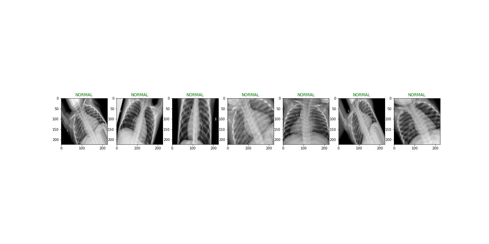
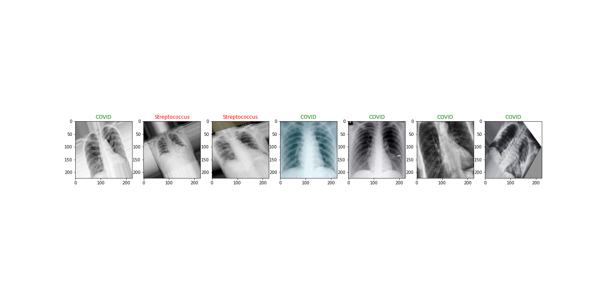
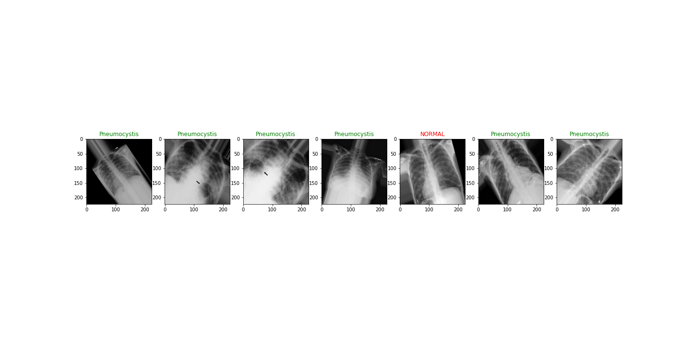
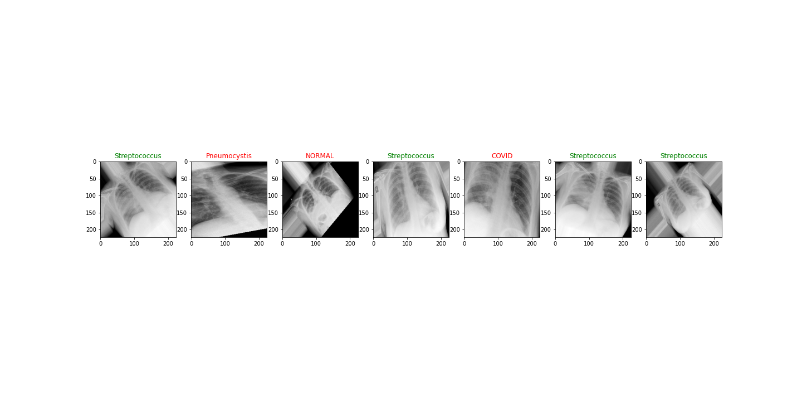
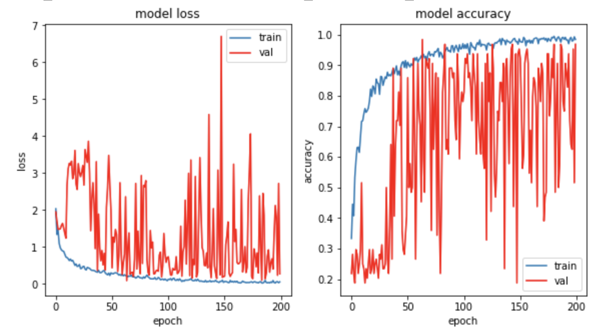
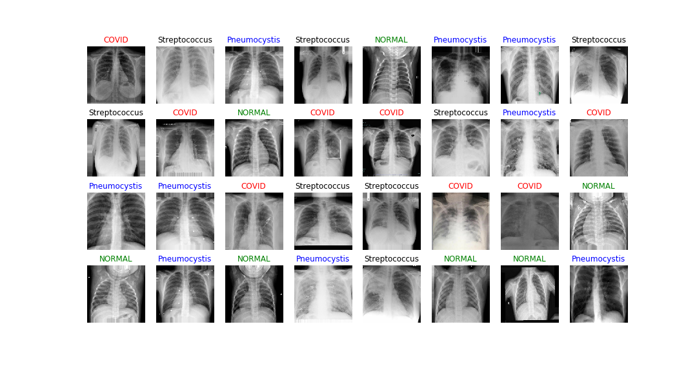
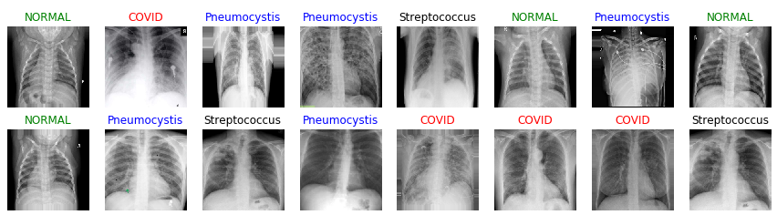

<p align="center">
  
</p>


# Artificial intelligence for lung disease detection using chest CT scan images

Artificial intelligence has the potential to help in covid detection using CT scan images from patient's chests. In this project, we apply two convolutional neural networks for image classification. 
Two data sets were gathered from Kaggle and Github for training Convolutional Nural Networks (CNN).
First, a two-class classification model was trained on balanced data (covid vs normal) to differentiate the healthy cases from covid cases.
Second, a neural network was trained to separate four classes including pneumocystis, covid, streptococcus, and normal. 
Two common approaches in image processing to deal with imbalanced data are class weight adjustment and over-sampling. The oversampling was done along with data augmentation (Applying different transformers for this purpose, flip, rotation, zoom) for four class classification project. The models were run on the local machine with a few epochs and later uploaded into the google-colab to benefit from Colab GPU. 


# Instruction

**Gathering data:** 
The X-Ray images were gathered from [Kaggle](https://www.kaggle.com/paultimothymooney/chest-xray-pneumonia) and [Github](https://github.com/ieee8023/covid-chestxray-datasetrepository).
The data ([All_data](https://github.com/Atashnezhad/Lung_Disease_Detection_Deeplearning/tree/Second/All_data)) then was divided into two Train Validation, and Test folders ([Dataset_augmented_subfolders](https://github.com/Atashnezhad/Lung_Disease_Detection_Deeplearning/tree/Second/Dataset_augmented_subfolders)) (two class classification project).
In four class classificaton project, the data ([All_data_4_classes](https://github.com/Atashnezhad/Lung_Disease_Detection_Deeplearning/tree/Second/All_data_4_classes)) was augmented ([Dataset_augmented_4_classes](https://github.com/Atashnezhad/Lung_Disease_Detection_Deeplearning/tree/Second/Dataset_augmented_4_classes)) and then was devided into four subfolders including Normal, Covid, Pneumocystis, Streptococcus ([Data_augmented_4_classes_train_test_val](https://github.com/Atashnezhad/Lung_Disease_Detection_Deeplearning/tree/Second/Data_augmented_4_classes_train_test_val)).

**Assembled Deep Net Model Layers:** 
Any time that you have several images (multiclass classification) use two to three convolution layers. Also, a use softmax as activation for the last layer as I did (my recommendation but you may test other types). Note that the categorical_crossentropy is almost default for multiclass classifiers. Remember that we always use convolution layers for images. the reason is if we use dense layers we will lose positional information in images.

**Prepare Images:**
Using ImageDataGenerator does the normalization (Resale function does normalization). Then augment the data set for both train and val.
Note that for the validation section, I just apply the normalization part. Next, use flow to apply the data augmentation.


For bi-class classification, the number of images is equal so there is no need for balancing the dataset. However, for multi-class classification, I have imbalanced data and I need to consider it to prevent bias. One way to deal with imbalanced data applies class-weight using following StackOverflow three lines code and pass it to the fit function.

```python
counter = Counter(train_generator.classes)                          
max_val = float(max(counter.values()))       
class_weights = {class_id : max_val/num_images for class_id, num_images in counter.items()}
```
**CNN model Metrics and Conclusion**

The call back function automatically save the best models taking the best val_acc into account. User can call different saved models and use for analysis.


# Discussion

* Both models including two class classification and four class classification were developed in python using keras library.
* For the two class classification the balance data set was used.
* In four class classification, the total number of noraml and covid were equal while the number of two other categories were under-balance. The number of other two classes were balanced taking the number of normal and covid casses into account. The generator was applied for generating new images. Check out the Over_Sampling_Images_second_approach file.
* In four class classification project weighted objective function was used to deal with imbalance data set.
* The four class classification codes was uploaded into the google colab to be ran using GPU. The learning curve of model is seen below.


* The two-class classification model accuracy achieved 80%.
* The four-class classification model accuracy achieved around 80%.


# Suggestion

* Balancing data using a generator is one option for dealing with imbalanced data but it is not always the best.
* The weighted objective function can be used as a second option.
* Generally, using either above options results in losing lots of feathered which results in low model accuracy.
* The results for the two-class classification project were promising and reliable.
* Different learning rate should be applied to see it will affect the output.


# Final CNN 4 Class Classification Results

<p align="center">
  
    
    
    
</p>


<!--
* The **Dataset** two categories are seen below.
<p align="left">
  
</p>

* The **Dataset_4_classe** four categories are seen below.
<p align="left">
  
</p>

-->


<!--
<p align="center">
  
</p>


-->


<!--
**Visualization**

- A visualization using visualkeras library for 4 class classification network is seen below.
<p align="center">
  
</p>


-->


<!--

- The second Convolutional Nural Networks layers were Visualized below.

<p align="center">
  
</p>

You can see that some filters check the edge of images while as we get far from images filters see the roundness of the image.
-->


<!--
* The CNN model different metrics are seen for biclass classification project below.


<p align="left">
  
</p>


* The CNN model different loss and accuracy metrics are seen for biclass classification project below.
<p align="left">
  
</p>


-->


<!--
* Below dataset images after applying augmentation adn balancing are seen.

<p align="left">
  
</p>

-->


<!--

### Table of Contents
The project directory tree structure is provided below.
```
├───Assets
├───Codes
├───Dataset
├───Dataset_4_classe
├───Dataset_4_classes_balanced
├───Dataset_4_classe_second_approach
├───Extract and filter images from data set
│   └───Dataset
│       ├───Covid
│       ├───NORMAL
│       ├───Pneumocystis
│       └───Streptococcus
└───Figures
```

-->


<!--
<p align="center">
  
  
</p>

-->


