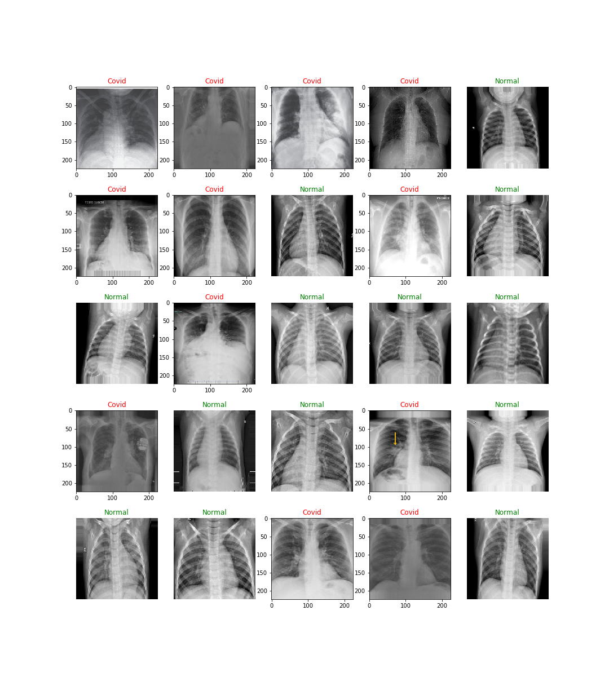
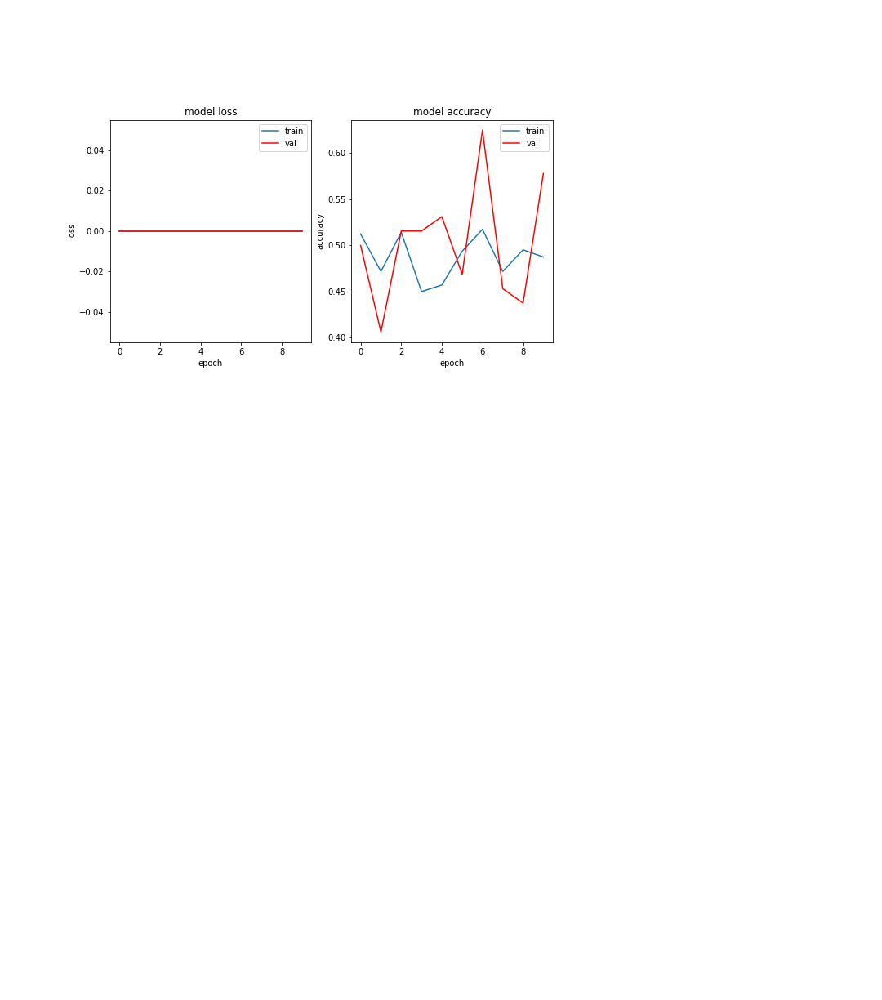

# CNN model to detect COVID from patients X-Ray image

Deep learning for covid 19 detections. Two sets of data including X-Ray images of Normal and covid patients were gathered.
The CNN developed and was applied for detecting COVID cases from normal. In the second part of this project, I will use the CNN m for detecting 20 different categories.

* Below dataset images after applying augmentation are seen.

  

* The CNN model different metrics are seen after 10 epoches.

  

