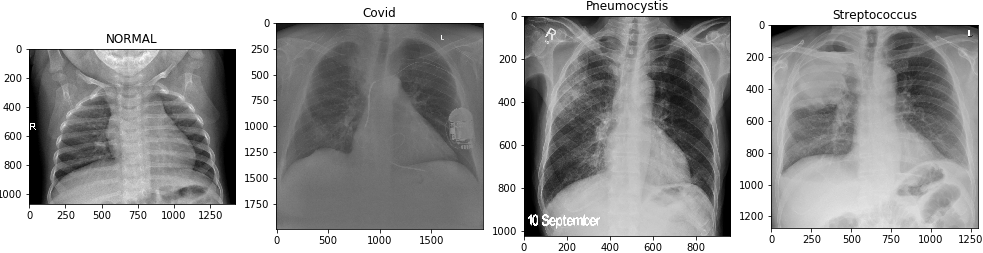
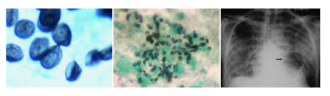
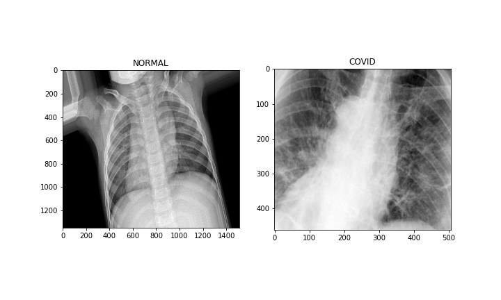
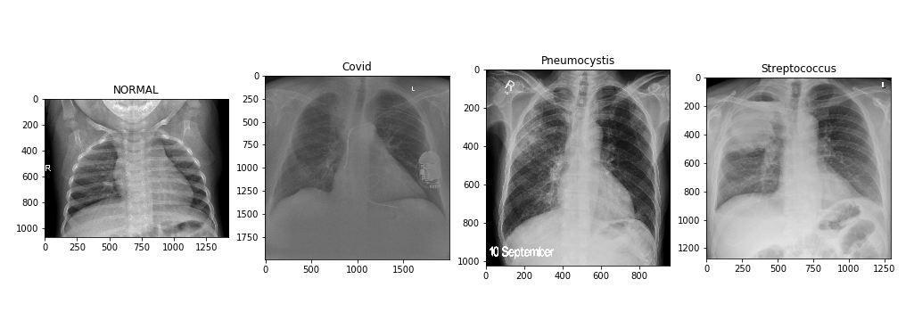
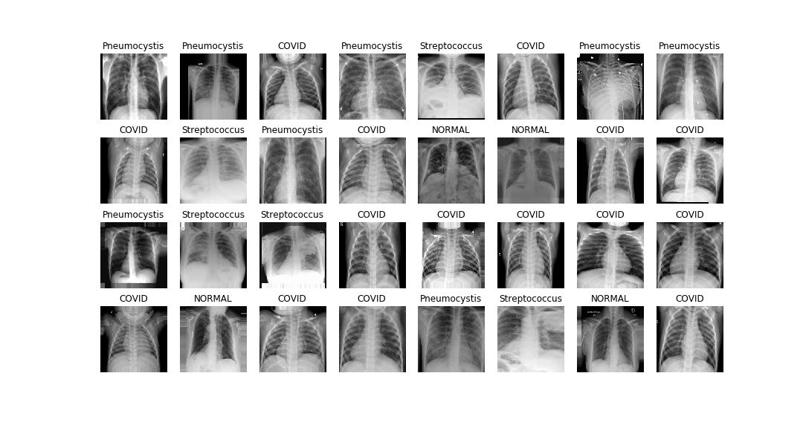
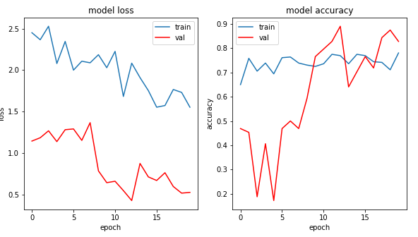
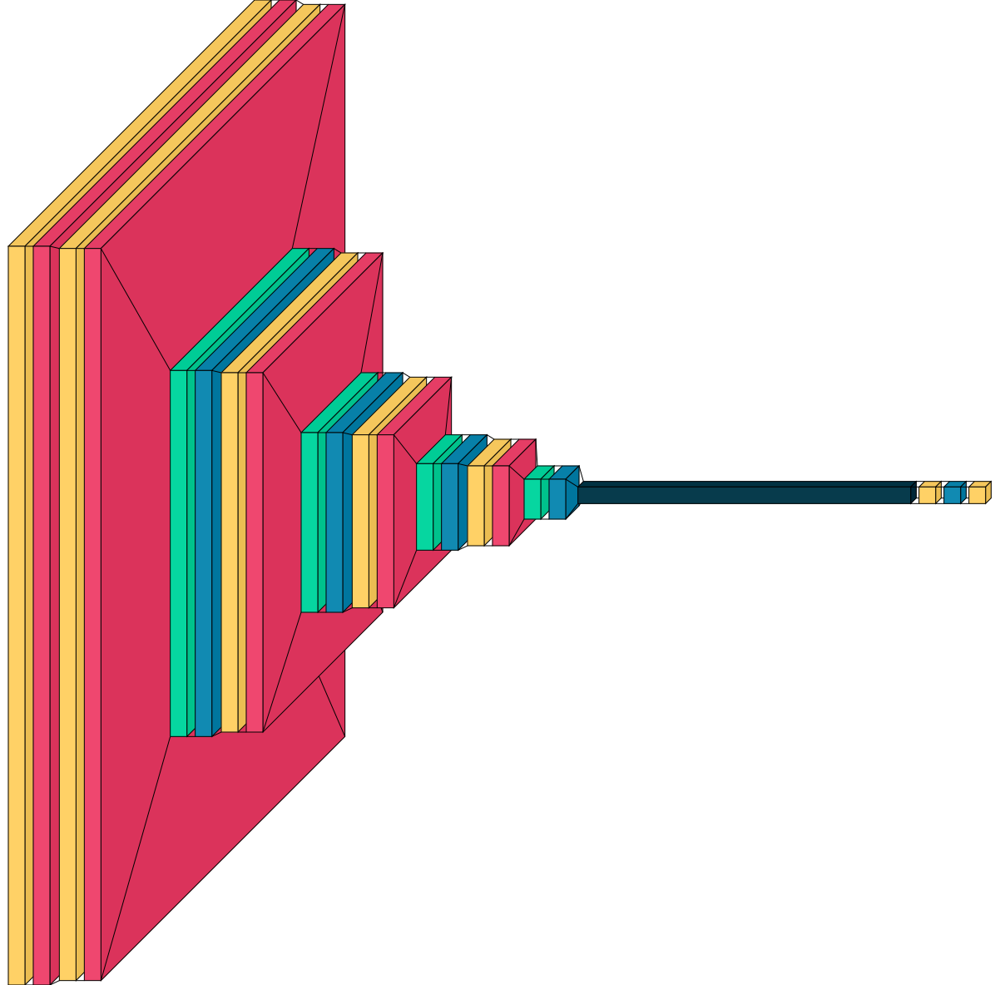
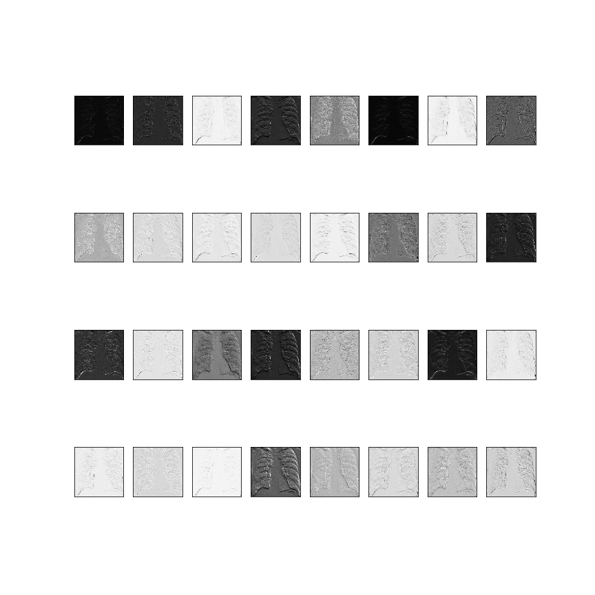
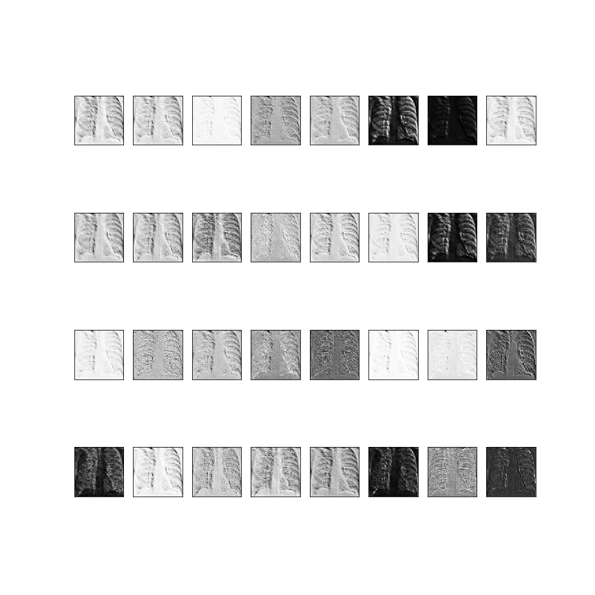

<p align="center">
  
</p>

# Lung disease detection using Deep learning


### Project Name:
Deep learning for detecting three lung sicknesses using X-Ray images

### Description:

This project includes two sub-projects including two-class classification and multi-class classification.

Two different data sets gathered from Kaggle and Github for training two different Convolutional Nural Networks (CNN).
The two-class classification model can differentiate between normal cases and covid cases. In this case, I had balanced number of images.
In the multiclass classification project, the data was imbalanced. I used two common approaches for dealing with imbalanced data in image processing including class weight adjustment and over-sampling.


The three lungs discuss definition is as follows.

* Pneumocystis pneumonia (PCP) is a serious infection that causes inflammation and fluid buildup in your lungs. It's brought on by a fungus called Pneumocystis jirovecii that spreads through the air. This fungus is very common. Most people's immune systems have fought it off by the time they're 3 or 4 years old.

<p align="left">
  
</p>

* COVID-19 is caused by a coronavirus called SARS-CoV-2. Older adults and people who have severe underlying medical conditions like heart or lung disease or diabetes seem to be at higher risk for developing more serious complications from COVID-19 illness.

<p align="left">
  
</p>

* Streptococcus is a genus of gram-positive coccus or spherical bacteria that belongs to the family Streptococcaceae, within the order Lactobacillales, in the phylum Firmicutes. Cell division in streptococci occurs along a single axis, so as they grow, they tend to form pairs or chains that may appear bent or twisted.


**The above definitions were gathered from Wikipedia and Google.**

### Table of Contents:
The project directory tree structure is provided below.
```
├───Assets
├───Codes
│   └───CNN_2_classes.ipynb
│   └───CNN_4_classes_Class_Weight_app.ipynb
│   └───CNN_visu.ipynb
│   └───Models
├───Dataset
│   ├───Train
│   │   ├───Covid
│   │   └───NORMAL
│   └───Val
│       ├───Covid
│       └───NORMAL
├───Dataset_4_classe
│   ├───Train
│   │   ├───Covid
│   │   ├───NORMAL
│   │   ├───Pneumocystis
│   │   └───Streptococcus
│   └───Val
│       ├───Covid
│       ├───NORMAL
│       ├───Pneumocystis
│       └───Streptococcus
├───Extract and filter images from data set
│   └───Dataset
│       ├───Covid
│       ├───NORMAL
│       ├───Pneumocystis
│       └───Streptococcus
└───Figures
```


### Instruction:

**Gathering data:** 
The X-Ray images were gathered from [Kaggle](https://www.kaggle.com/paultimothymooney/chest-xray-pneumonia) and [Github](https://github.com/ieee8023/covid-chestxray-datasetrepository).
The data then was divided into two Train and Validation folders.
Two data sets were prepared which are **Dataset** and **Dataset_4_classe**.
* The **Dataset** two categories are seen below.
<p align="left">
  
</p>

* The **Dataset_4_classe** four categories are seen below.
<p align="left">
  
</p>

In this project, we use the deep neural network to differ the normal patients from three different sicknesses including Pneumocystis, COVID-19, and Streptococcus.
As it is seen in the project directory, the multi-class classification data set (Dataset_4_classe) included four different sub-folders compare to two bi-class classification data set (Data set).


**Assembled Deep Net Model Layers:** 
Any time that you have several images (multiclass classification) use two to three convolution layers. Also, a use softmax as activation for the last layer as I did (my recommendation but you may test other types). Note that the categorical_crossentropy is almost default for multiclass classifiers. Remember that we always use convolution layers for images. the reason is if we use dense layers we will lose positional information in images.

**Prepare Images:**
Using ImageDataGenerator does the normalization (Resale function does normalization). Then augment the data set for both train and val.
Note that for the validation section, I just apply the normalization part. Next, use flow to apply the data augmentation.
* Below dataset images after applying augmentation are seen.
<p align="left">
  
</p>
For bi-class classification, the number of images is equal so there is no need for balancing the dataset. However, for multi-class classification, I have imbalanced data and I need to consider it to prevent bias. One way to deal with imbalanced data applies class-weight using following StackOverflow three lines code and pass it to the fit function.

```python
counter = Counter(train_generator.classes)                          
max_val = float(max(counter.values()))       
class_weights = {class_id : max_val/num_images for class_id, num_images in counter.items()}
```
**CNN model Metrics and Conclusion**

The call back function automatically save the best models taking the best val_acc into account. User can call different saved models and use for analysis.
* The CNN model different metrics are seen for biclass classification project below.
<p align="center">
  
</p>

* The CNN model different loss and accuracy metrics are seen for biclass classification project below.
<p align="left">
  
</p>


**Visualization**

- A visualization using visualkeras library for 4 class classification network is seen below.
<p align="center">
  
</p>

- The second Convolutional Nural Networks layers were Visualized below.

<p align="center">
  
</p>

- The third Convolutional Nural Networks layers were Visualized below.

<p align="center">
  
</p>

You can see that some filters check the edge of images while as we get far from images filters see the roundness of the image.
